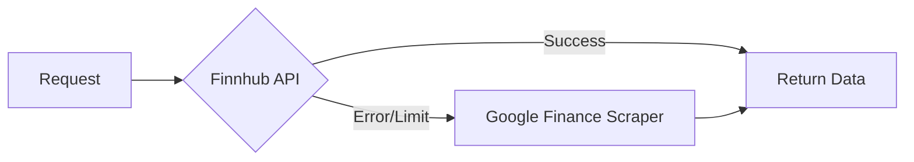
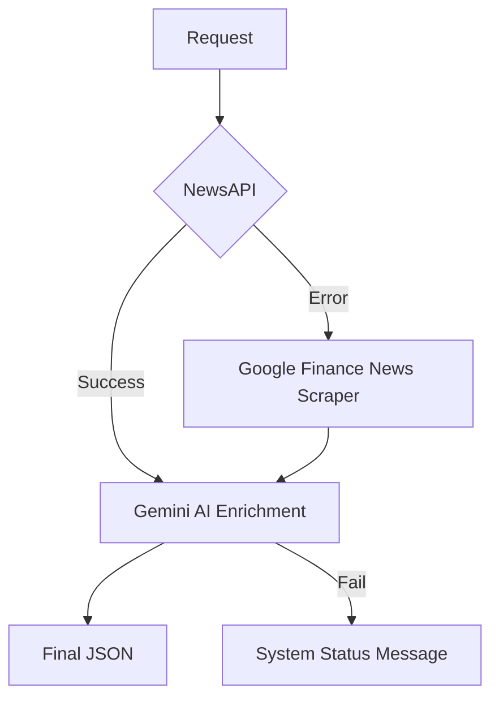

# tech reference: MarketMind V2 Upgrades

This document serves as a technical knowledge base for engineering agents maintaining or extending MarketMind.

## 🚀 Project Evolution (V2)
The project transitioned from a basic mock-data dashboard to an enterprise-grade financial intelligence platform.

## 🏛️ System Architecture

### Frontend (Next.js 15 + Tailwind)
- **State Management**: Uses React `useState` and `localStorage` for user portfolios. 
- **Personalized UI**: The Dashboard dynamically merges hardcoded market indices (S&P 500, etc.) with user-defined tickers from `localStorage`.
- **Navigation**: Tab-based sidebar (`activeTab` state) with dedicated modules for **News Feed**, **Portfolio**, **AI Chat**, and **Stock Analysis**.

### Backend (Go + Gin)
- **Persistence**: Currently uses in-memory caching:
  - **Stock Quotes**: 1-min TTL.
  - **News Feed**: 5-min TTL (prevents scraper slowdowns).
- **AI Orchestration**: Direct integration with **Gemini 3 Flash** for structured data extraction and sentiment analysis.

## 📡 Data Pipelines & Resilience

### 1. Stock Quotes Pipeline

- **Fallback Logic**: Implemented in `handlers/finnhub.go`. If the professional API fails, the `goquery`-based scraper in `handlers/scraper.go` parses real-time prices from Google Finance quote pages.

### 2. Intelligent News Pipeline (Hybrid)

- **Robustness**: A triple-layer safety net ensures **never-fail** news delivery. 
- **Enrichment**: Gemini classifies raw headlines into `sentiment` (bullish/bearish/neutral) and `category` (Tech, Finance, etc.).
- **Zero-Crash Policy**: Even if all external sources fail, the backend returns a `200 OK` with a system status message to keep the UI alive.

## 🛠️ API & Component Reference

### Key Handlers
- `FetchNewsHybrid`: Primary news gateway with AI enrichment.
- `FetchFinnhubQuotes`: Primary price gateway with scraper fallback.
- `ScrapeGoogleFinance`: Logic for extracting data from `.YMlKec` (price) and `.JwB6zf` (percentage) elements.
- `EnrichWithGemini`: Specialized prompt engineering for financial sentiment.

### Critical Files
- `handlers/newsapi.go`: The most complex logic flow (Auth + Enrichment + Fallbacks).
- `handlers/scraper.go`: Generic `goquery` selectors for Google Finance.
- `src/app/page.tsx`: Main React component managing tab state and synchronized data fetching.

---
*Created during an intensive optimization session focused on data resilience and AI-powered personalization.*
